# skill-matching-assessement-platform

## Aperçu de la plateforme

### Authentification
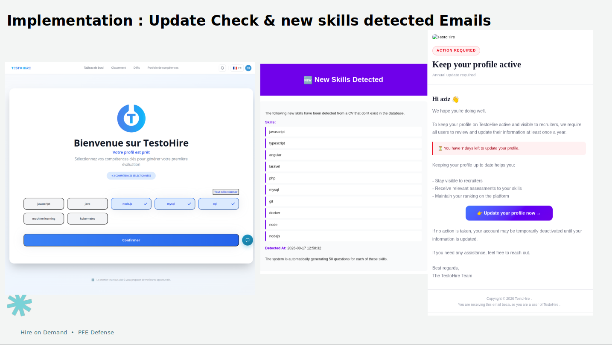

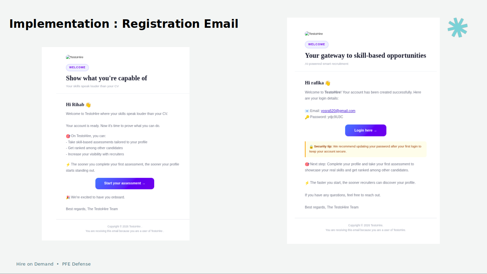

### Côté candidat
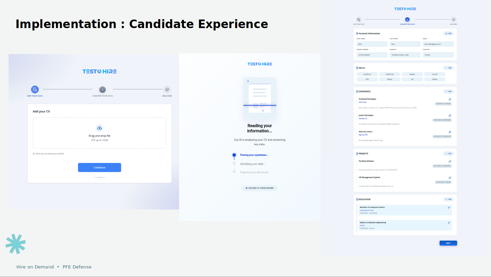
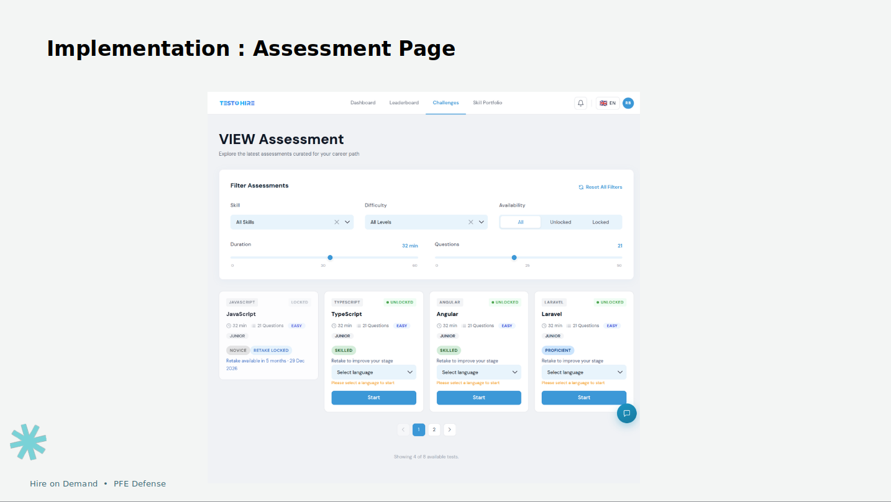
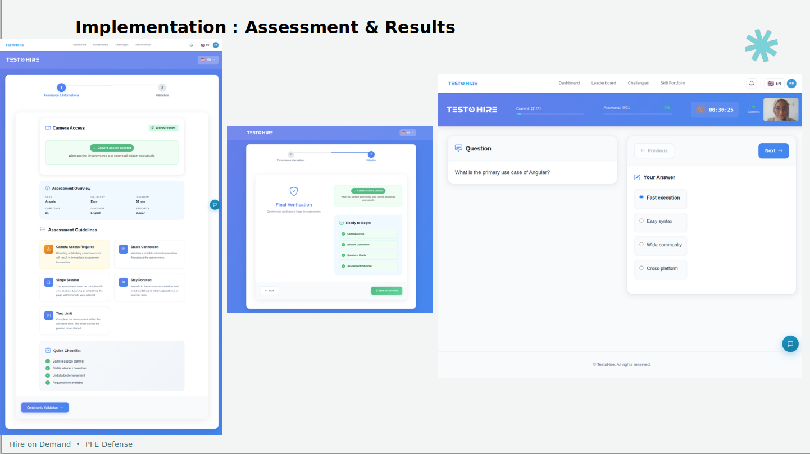
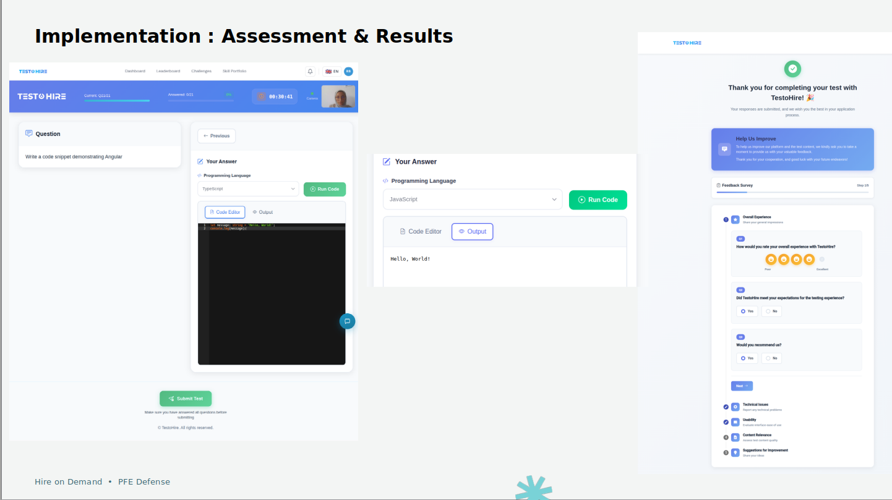
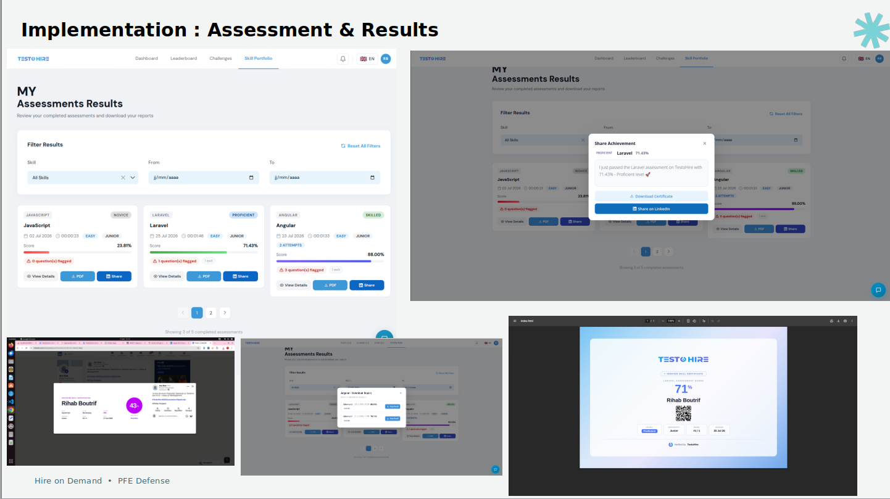
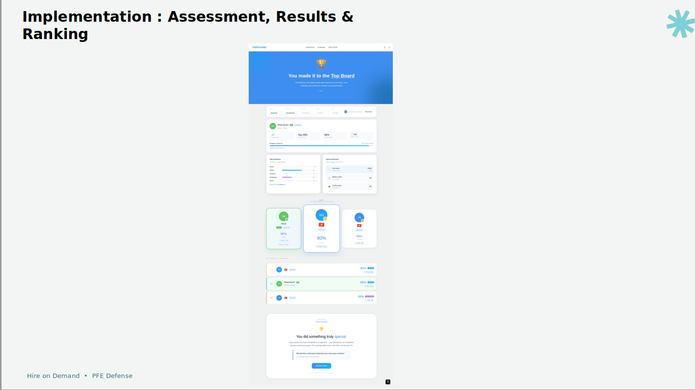
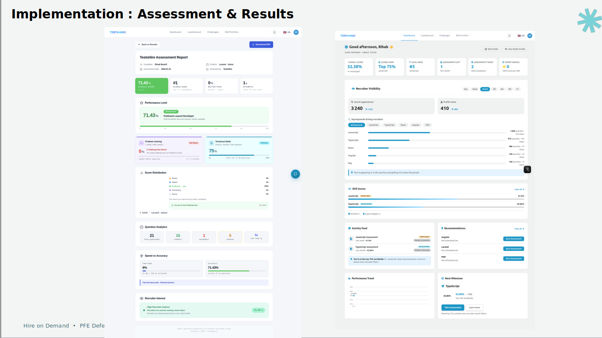

### Côté recruteur
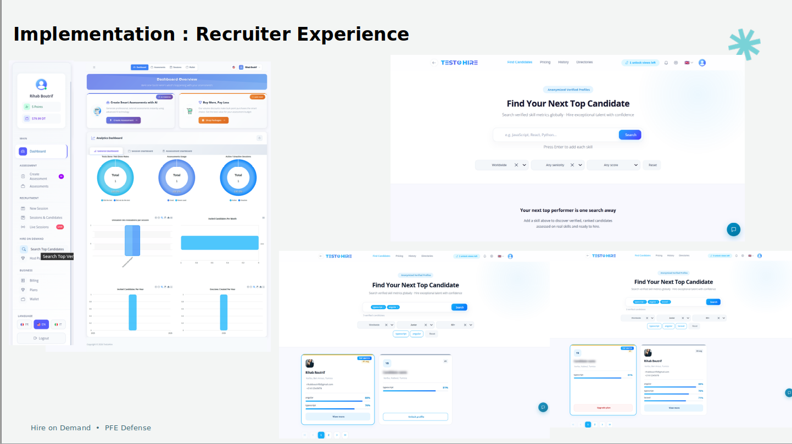
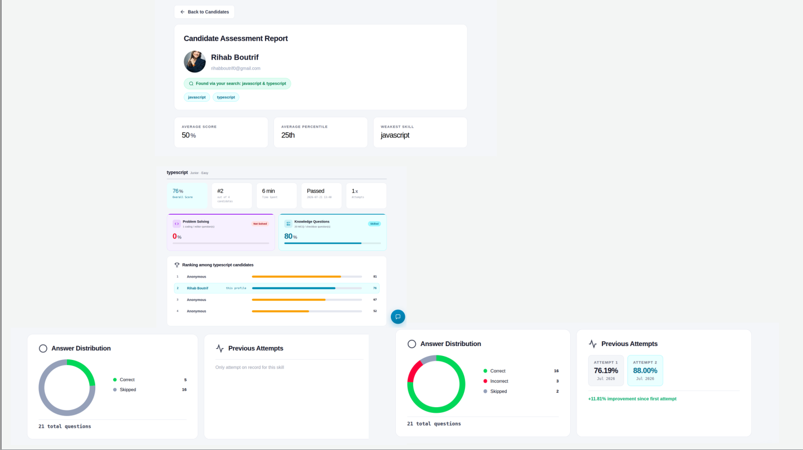
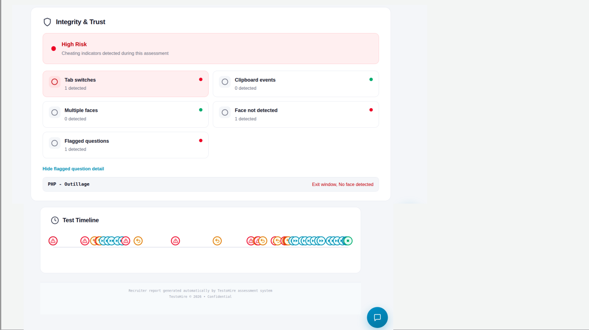
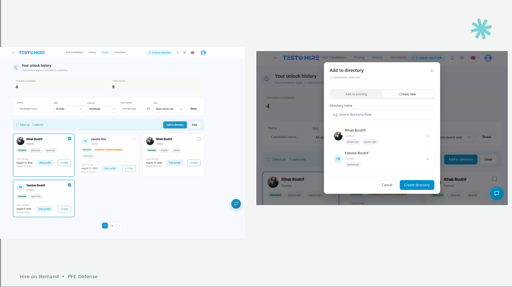
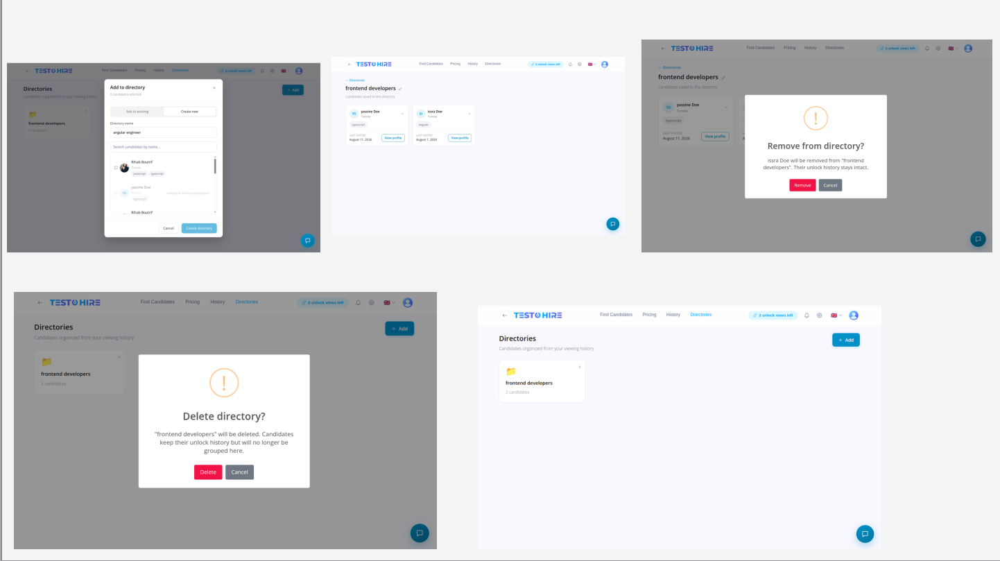
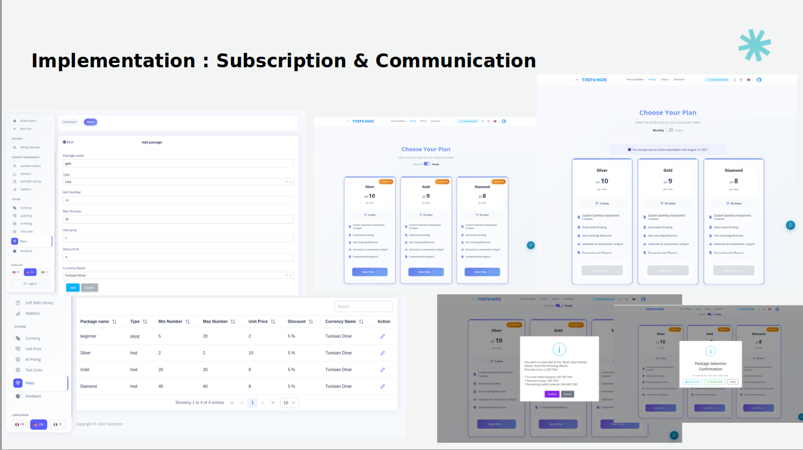
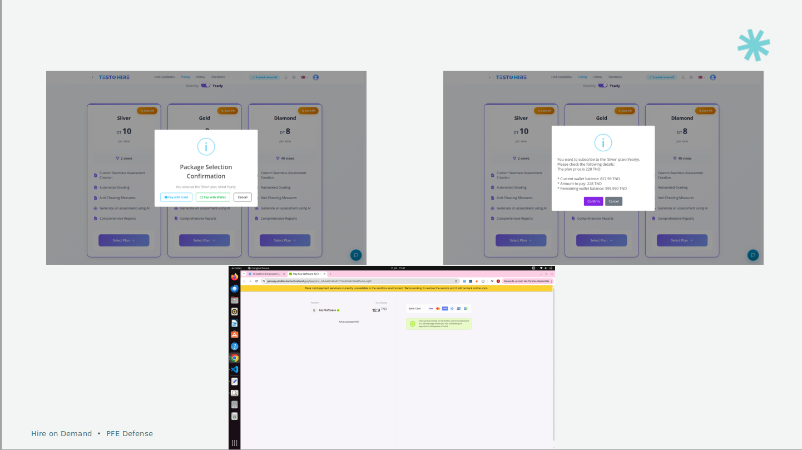

### Communication
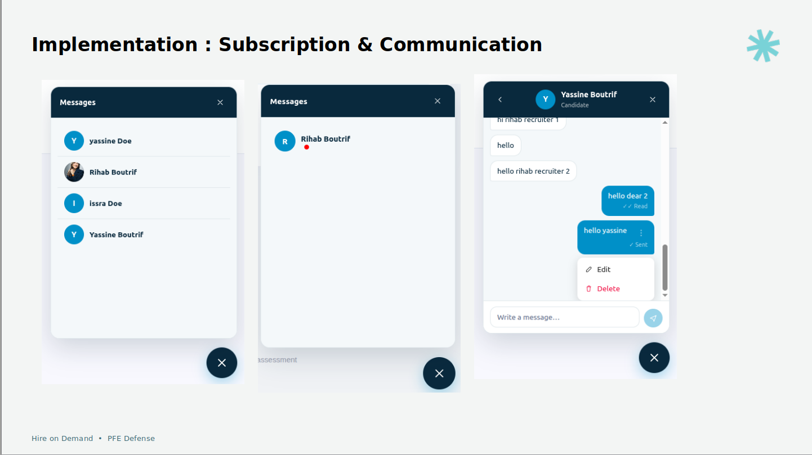

## Présentation
[Télécharger la présentation du projet](presentation.pptx)
